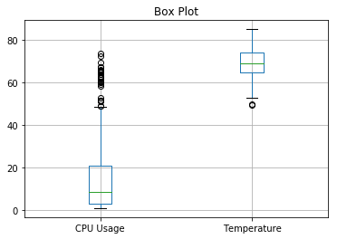

# RPI_CPU_on_googlesheet
This repository has python codes which are designed to detect CPU Usage and temperature of raspberry pi every 20 second and update it on Google sheet.
https://console.developers.google.com/iam-admin/projects
1. Click on above link to Google APIs > IAM(Identity and Access management )& Admin> All Project, then click "CREATE PROJECT" e.g. rpidata
2. Click Go to Credentials and select service account.
3. select JSON key type and click Create key to download rpidata-xxxxxxxxx.json.
4. On raspberry pi, install packages, and copy code to your directory.
  sudo pip install -U gspread oauth2client
  mkdir <dir name>
  cd <dirname>
  cp ~/RPI_CPU_on_googlesheet/system_info.py
    cp ~/RPI_CPU_on_googlesheet/rpi_spreadsheet.py
5. Copy the json file to the same directory as rpi_spreadsheet.py
6. Go to google sheets and start new spreadsheet e.g. rpidata
7.Share the spreadsheet with the "client email" address in the .json file and select "can edit" then delet rest of the rows.
8. On terminal window, run python rpi_spreadsheet.py
     

